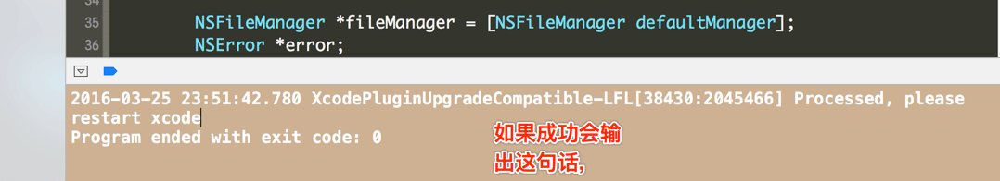
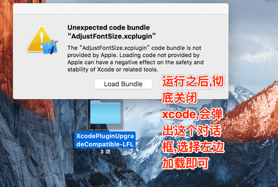
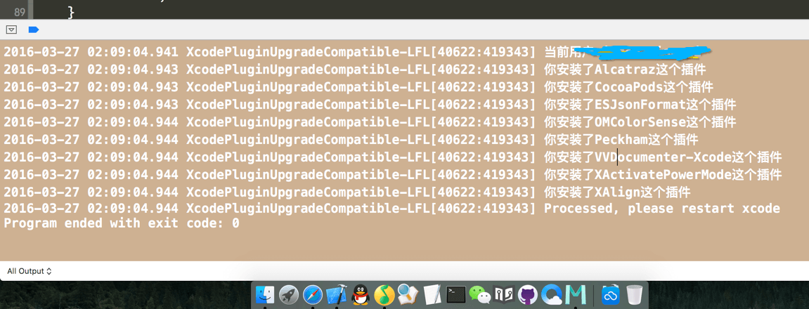

# XcodePluginUpgradeCompatible

> `Xcode8` 后 Apple 官方`Xcode` 已支持内嵌插件。故而仅对之前版本Xcode有效。


> [](http://github.com/DevDragonLi/XcodePluginTool)
[](http://github.com/DevDragonLi/XcodePluginTool/fork)


- **[曾经Xcode常用的插件收集列表](#XcodePlugin)**

### Stargazers over time

[](https://starcharts.herokuapp.com/DevDragonLi/XcodePluginTool)


## content 

###  **Compatible**
	
- **Xcode7** : 运行工程文件后,重启Xcode即可  tips : Xcode重启后会要求用户确认是否加载非苹果官方插件，请选择`Load Bundles`

- **Xcode8+** 

	- [steakknife site ](https://github.com/steakknife/unsign)
	
	```
	git clone https://github.com/steakknife/unsign.git
	cd unsign &&	make    

	```
	
-  使用unsign为xcode移除签名 ,会在/Applications/Xcode.app/Contents/MacOS/下生成Xcode.unsigned,备份好原始的Xcode，把Xcode.unsigned重命名为Xcode，重启Xcode即可

	- ./unsign /Applications/Xcode.app/Contents/MacOS/Xcode

- 再次重启Xcode,如果以前插件无法运行,请下载本工程,运行一遍即可
		


## 工程文件说明

> 特别说明,此版本为解决Xcode8前插件处理终结版本(只要是Xcode版本升级,导致不插件无法加载,都可以尝试使用此工程命令修正,觉得好用,还望给个star ,谢谢!

>  有群里小伙伴反馈,如果电脑的用户名曾经更改而且没有更改个人目录那么获取的路径无效,修正后为不获取用户名,而是获取用户下个人目录方式.并且打印台也打印一下你插件目录安装插件都是哪些.

-  直接上图(很简单一步到位)






- 新增加打印插件名



## why ? 

 - 每当Xcode升级之后，都会导致原有的Xcode插件不能使用，这是因为每个插件的Info.plist中记录了该插件兼容Xcode版本的DVTPlugInCompatibilityUUID，而每个版本的Xcode的DVTPlugInCompatibilityUUID都是不同的。如果想让原来的插件继续工作，我们就得将新版Xcode的DVTPlugInCompatibilityUUID加入到每一个插件的Info文件中，手动添加的话比较费时间还可能出错

 
- Whenever the Xcode after upgrading, will cause the original Xcode can not use the plugin, this is because each plugin Info. The records in the plist DVTPlugInCompatibilityUUID Xcode version of the plugin compatibility, and each version of Xcode DVTPlugInCompatibilityUUID is different.If you want to keep the original plug-in work, we will have the new Xcode DVTPlugInCompatibilityUUID added to each plugin Info file, manually add more time-consuming they might be wrong.


## <a name="XcodePlugin"></a>Xcode常用的插件,不包含Xcode8后自带功能的插件.

-  [Alcatraz](https://github.com/supermarin/Alcatraz)一个开源的Xcode 包管理器，可以让你更便捷地发现、安装以及管理插件、模板和配色方案。只需要简单地点击或者勾选，不需要手工复制和粘贴。


-  [KSImageNamed-Xcode](https://github.com/ksuther/KSImageNamed-Xcode)使用[UIImage imageNamed:@"xxx"]时，该插件会扫描整个workspace中的图片文件。 Swift已经有原生支持了.

- [Auto-Importer-for-Xcode](https://github.com/lucholaf/Auto-Importer-for-Xcode)是一款自动包含所需头文件的插件，省去烦人的import，这样一来你写代码都顺畅。

- [synx](https://github.com/venmo/synx)Xcode虚拟文件夹整理利器。

## 有任何问题，请及时 issues me 

 > `dragonli_52171@163.com`
 

## License

English: this library is available under the MIT license, see the LICENSE file for more information.  
